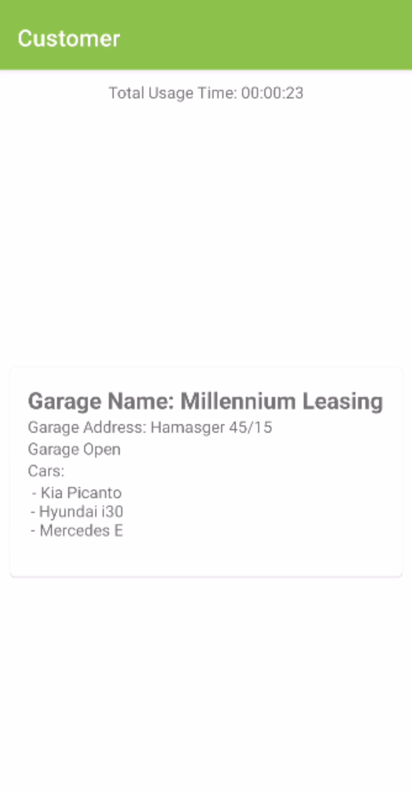
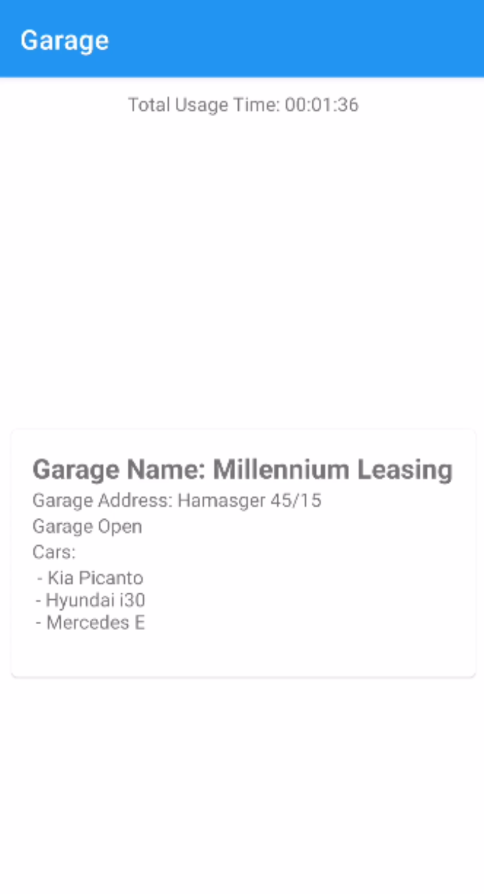

# MultiAppProject
Simple multi app project includes two applications, one for garage and the other for customer. It uses Retrofit library to fetch the garage data from the server, and Room sql library to save the total usage time of the application

    
